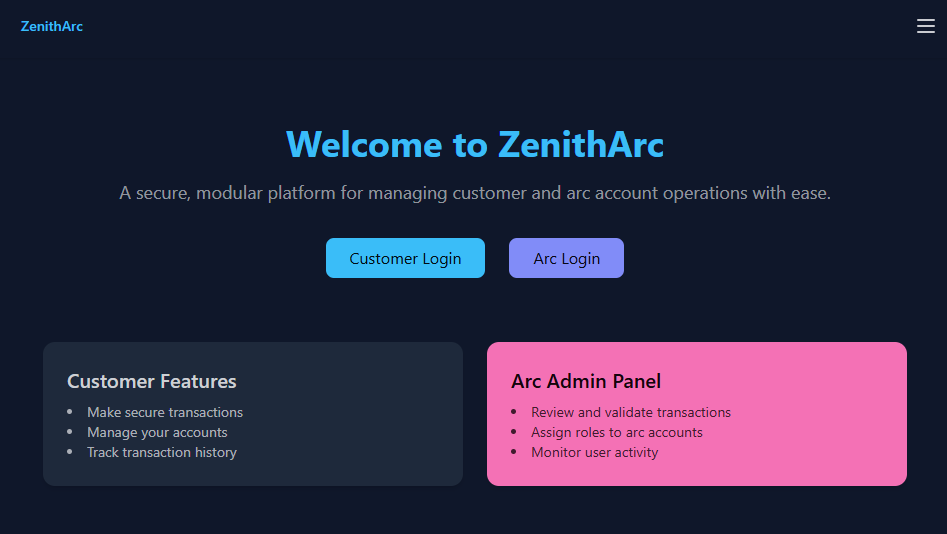
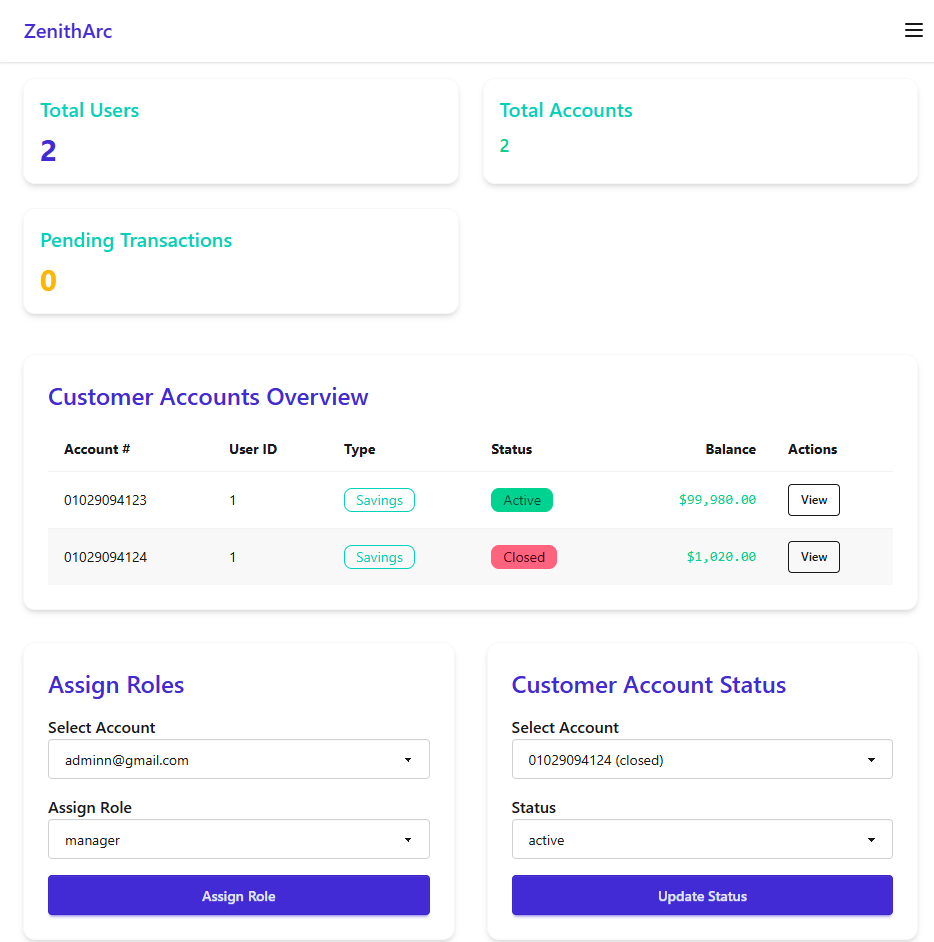

# 🌠 ZenithArc - Online Banking System

ZenithArc is a secure and extensible online banking platform built with Ruby on Rails. It provides core banking functionality such as user management, account handling, fund transfers, transaction history, and role-based access control — all ready to expand into a full-scale banking system.

## 🖥️ UI Screenshots

  
  

## ✨ Features

- 🔐 **Devise Authentication** (login, registration, password recovery)
- 🧑‍💼 **Role-Based Access Control**
- 💳 **Bank Accounts** (multiple accounts per user)
- 💸 **Internal Transfers** (between accounts)
- 📜 **Transaction History** (ledger-like logs)
- 📦 Scalable modular architecture with future support for:
  - Loans
  - Investments
  - Payments
  - Notifications

## 🛠 Tech Stack

- **Ruby on Rails** (>= 8.0)
- **PostgreSQL**
- **Devise** (authentication)
- **Pundit** (authorization)
- **Tailwind CSS** (for styling)
- **RSpec** (test suite)

📜 License
MIT License. See LICENSE for details.

